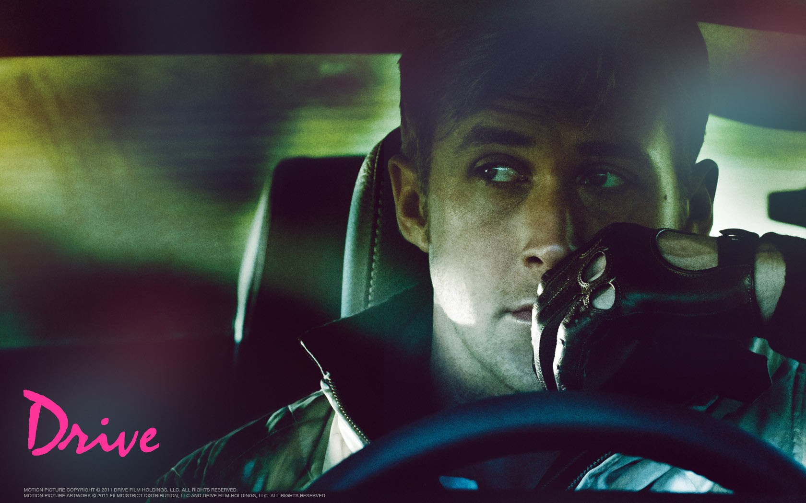

The Drinking Game Review of: Drive (2011)
===============================

Courtesy Drive Film Holdings LLC

This is the inaugural article in what I hope will become a long-running feature on this site: the Drinking Game Review. It's my own little twist on the typical movie review and analysis column, pairing two things that are good on their own, but go even better together: great films and booze.

I Have to Ask, Why?
-------------------
Glad you did, dear reader. Is this a gimmicky attempt to get those sweet internet-clicks? You bet it is! But I do believe there are legitimate justifications for this particular format, namely:
1. Most film reviews fail to actually add anything to the movie-viewing experience, merely imparting to the consumer whether they should see the film. Hopefully this column will provide you all with some extra content, a fun game to play with friends and an excuse to drink, in addition to its function as a recommendation.
2. Film reviews lose their value as soon as the audience has actually seen the film because at that point the recommendation loses its value. This column solves that issue by hopefully spicing up repeat viewings of the films reviewed.
3. Drinking games help provoke audience participation in the film. While they might risk distracting the audience, drinking games force the audience to pay some sort of attention to the film. Throughout this column I will endeavor to suggest nuanced circumstances under which the audience should drink. These situations will often involve the audience judging the film for themselves or contrasting it with other films. At other times, the circumstances to drink might be the result of me attempting to draw attention to particularly interesting or important stylistic decisions in the making of the film.
4. Preparing for this column allows me to feel like a cut-rate postmodern Charles Bukowski.
5. Many reviews are too focused on whether to recommend the film to the audience. This column will not focus on that angle. Anything I review here will worth a viewing. It may not be a always quality film, in fact it quite likely will not be as I bear an unhealthy appreciation for shlock, but the films I present will always be entertaining whether due to their successes, their failures, or the pairing of chemical compounds with these aspects.
So with that boilerplate out of the way...

A Real Human Being...
---------------------
So why this relatively innocuous, not recent but not classic independent film? Drive has left a lasting footprint on various mediums with its stylish ultra-violence and sound design. The indie mass-slaughter simulator Hotline Miami clearly drew inspiration from Drive for its stellar soundtrack and out-of-the-blue brutality, with its creators even crediting the film as influencing them. Furthermore, Drive's soundtrack advanced the fledgling retro synthwave genre by placing that 80s inspired music front and center much of the film. Which brings us to our first drink-trigger:
- Drink when a more 80s than the actual 1980s track plays

Of particular note are "A Real Hero" by College feat. Electric Youth and "Nightcall" by Kavinsky, which plays during the opening credits.

Drive, while a crime film, avoids violence for much of its runningtime, instead developing the relationship between the unnamed driver (Ryan Gosling) and his neighbor/love interest Irene (Carey Mulligan). However, the driver is exceedingly quiet throughout much of the film, which could be a commentary on how the strong, silent leading man archetype is just as likely to come across as awkward and somewhat creepy in real life, in contrast to Hollywood's glamorization of that particular brand of introvert. Gosling says little throughout the film, and his primary means of communicating his growing investment in his neighbors is nonverbal, so:
- Drink when Ryan Gosling awkwardly smiles without laughing or saying anything

However, the second half of the film shatters the mumblecore-adjacent relationship building with a terrific excess of violence that doesn't leave a tremendous body count in comparison with some films, but every act of violence is very visceral and the driver accrues indicators of it on his signature jacket, in some ways reminiscent of a horror flick's protagonist becoming increasingly wretched as the violence escalates. In what will likely become a recurring trigger in this column:
-Drink when someone is brutally murdered.

And A Real Hero
---------------
To recap:
- Drink when a retro-sounding tune is played, diagetically or otherwise
- Drink when Ryan Gosling's driver smiles awkwardly
- Drink on every death

Additionally, if you'd like to escalate your drinking further, add the following rule:
- Danger Zone: Drink every time Ryan Gosling drives a car.

If you're less alcohol tolerant or don't want to drink much, consider replacing one of the core rules with:
- Teetotaler: Drink every time Ryan Gosling says more than one sentence in a row.
